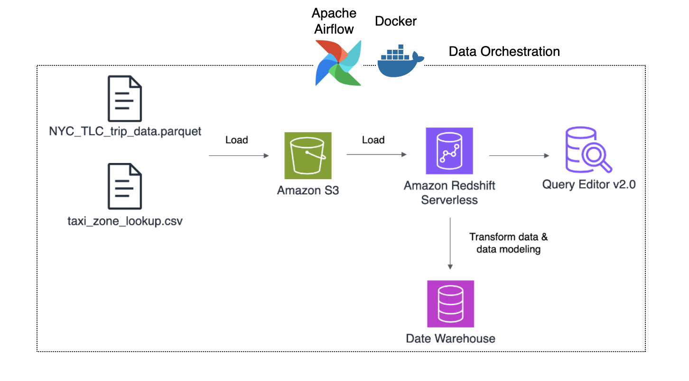
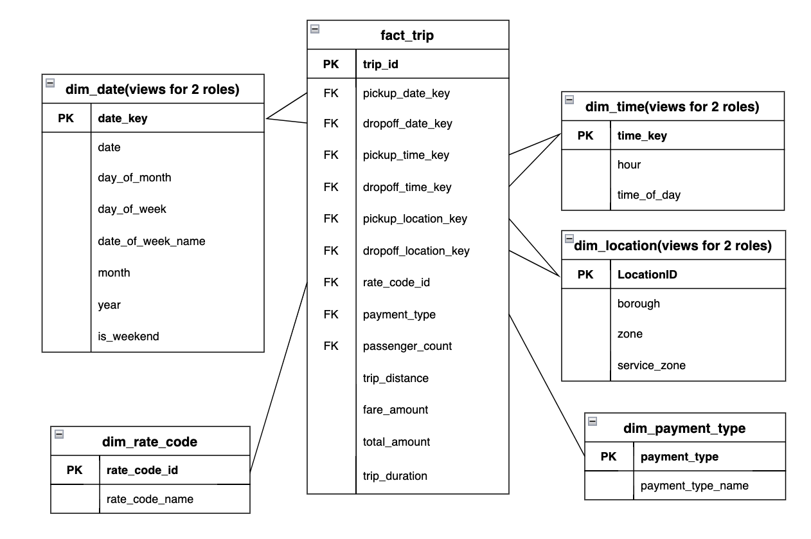
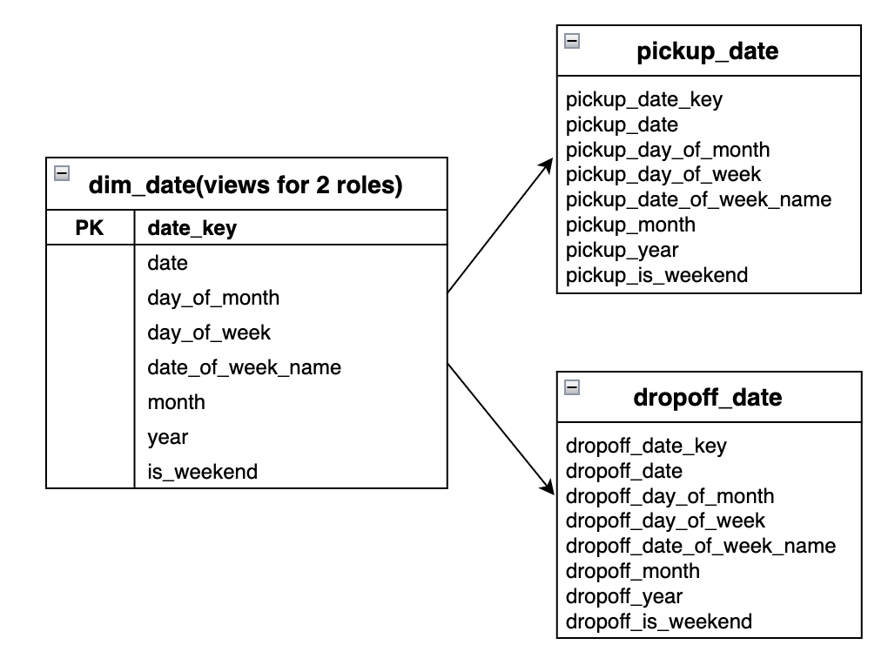
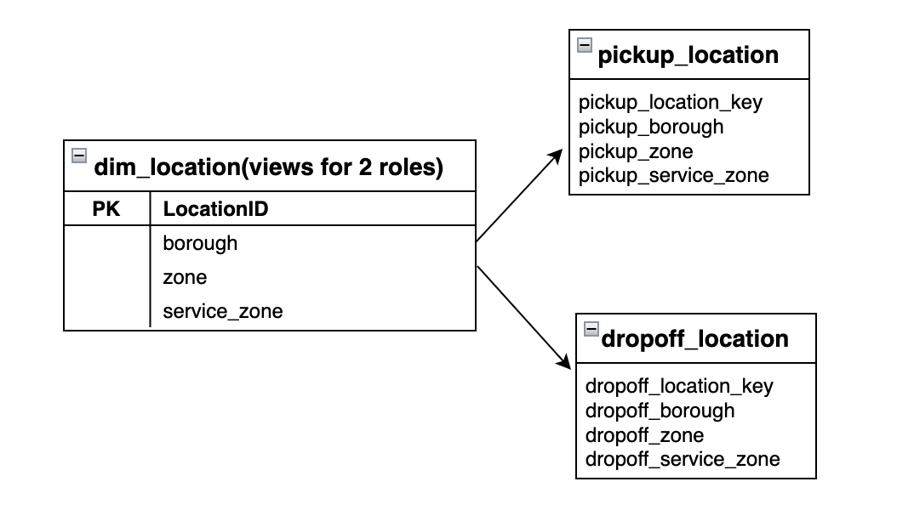
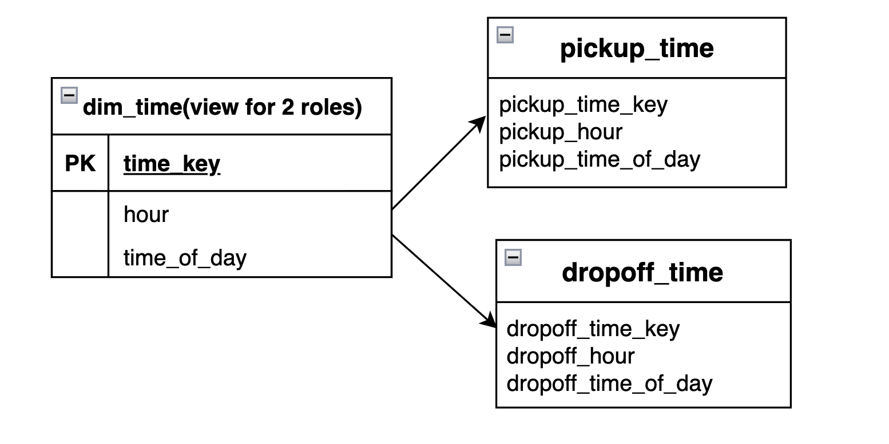
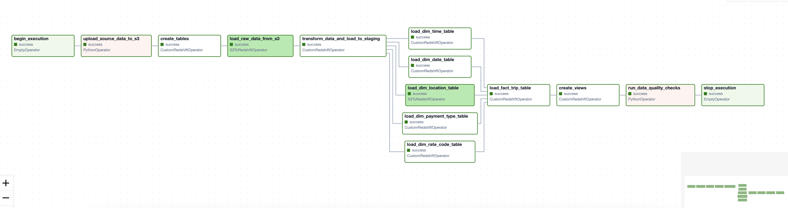
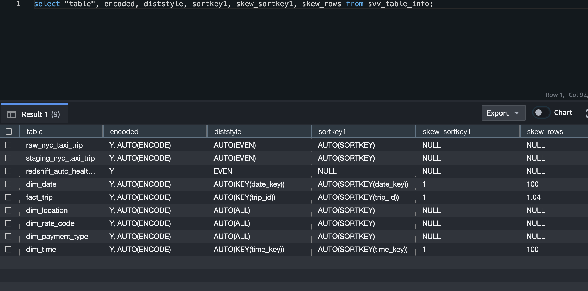
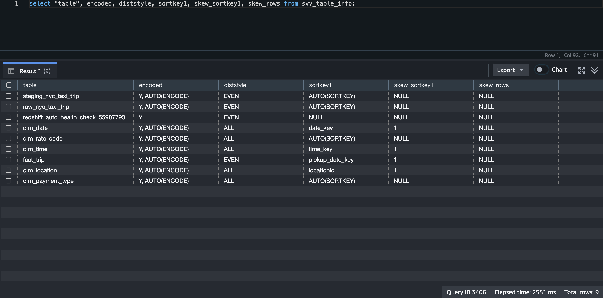
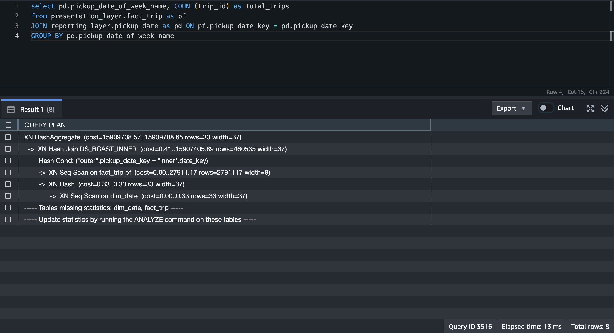
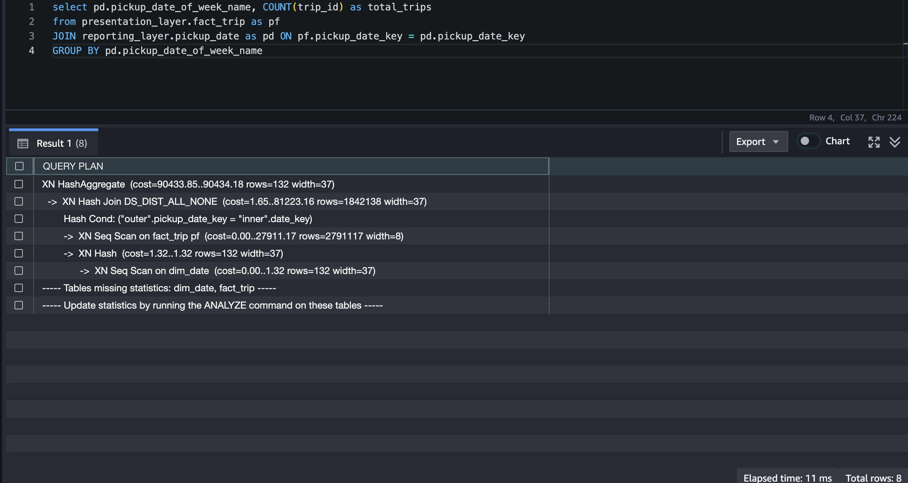

## Project Description:
The New York City Taxi and Limousine Commission (TLC) wants to analyze the taxi trip data every month to understand what customers do and what they need. This will help them make better decisions to improve their services and make rides better for passengers.

The project’s goal is to create an ELT pipeline that can manage a large database of taxi trip records, set to update automatically with new data each month. This system will also include data modeling, to efficiently answer business questions and provide actionable insights, such as:
 * At what times of the day is the demand for taxis at its peak?
 * Which day of the week experiences the highest demand for pickups, and at what times?
 * Which locations in and around New York City have high pickup frequencies?
 * How does the average trip duration vary across different boroughs in New York City?
 * What are the most common payment methods used by passengers?

### Data Details: 
The dataset is sourced from https://www.nyc.gov/site/tlc/about/tlc-trip-record-data.page
* **Trip Record Data:** The February 2024 dataset, `NYC_TLC_trip_data_2024_02.parquet`, contains around 3 million yellow taxi trip records. Each record has 19 details about the trip, like pick-up and drop-off timestamps, pick-up and drop-off locations, trip distances, breakdown of fares, types of rates, methods of payment, and driver-reported passenger counts. The detailed explanation of this data is provided in the data dictionary. https://www.nyc.gov/assets/tlc/downloads/pdf/data_dictionary_trip_records_yellow.pdf

* **Geographical Details**: The `taxi_zone_lookup.csv` provides key location details such as service zones, taxi zones, and boroughs. This information is important in understanding patterns of travel and areas of high demand, thereby contributing to a more comprehensive analysis.

# NYC Taxi - Data Warehouse on AWS 

 

1. **Data Ingestion:** Raw data files, such as `NYC_TLC_trip_data.parquet` and `taxi_zone_lookup.csv`, are loaded into Amazon S3. This serves as the primary storage location for incoming raw data files.

2. **Data Loading:** From S3, the raw data is transferred into Amazon Redshift Serverless, using the `COPY` command, which efficiently moves large datasets from S3 to Redshift.
   
3. **Data Transformation and Modeling:** Amazon Redshift Serverless acts as a data warehouse, where the data undergoes transformation and modeling processes, making it ready for analysis.
  
4. **Data Orchestration:** The steps are orchestrated using Apache Airflow, which is containerized using Docker.
   
5. **Data Analysis:** Using Query Editor v2.0, data analysts and BI teams can run SQL queries on the data warehouse to generate insights, create reports, and visualize data trends.

## Data Model for Taxi Trip Analysis
Data modeling enables effective analysis by designing a well-structured schema that shapes trip data within the data warehouse.

The data model below is a Star Schema with Role-Playing Dimensions, a common design approach in Kimball's dimensional modeling. This includes a central fact table (fact_trip) and surrounding dimension tables (dim_date, dim_time, dim_location).
 

**Grain:** The `fact_trip` table's grain represents the most detailed level of data, with each row corresponding to a single trip.

**Fact Table:** The fact_trip table is designed to store measurable and quantitative metrics that adhere to the defined grain, enabling a wide range of analysis and reporting.

* **Additive Facts:** `fare_amount`, `tip_amount`, and `total_amount` are sourced directly from the data and can be summed across various dimensions.
* **Derived Facts:** `trip_duration` is derived from the difference between pickup_datetime and dropoff_datetime, representing the length of the trip.

**Dimension Tables:** These tables provide context and descriptive attributes for the data in the fact table:
  * **Date Dimension**: `dim_date` contains unique date entries with attributes like day_of_month, day_of_week, etc.
  * **Time Dimension:** `dim_time` maintains unique entries per hour. The time and date dimensions are kept separate for granular analysis and storage efficiency.
  * **Location Dimension:** `dim_location` includes geographic data such as zone and borough.
  * **Payment and Rate Dimensions:** `dim_payment_type` and `dim_rate_code` hold static values as defined by the data dictionary.
  
**Relationships:** The PK (Primary Key) in dimension tables and FK (Foreign Key) in the fact table establish relationships, allowing for complex queries and analysis across different dimensions.

**Role play dimensions:** These dimensions allow a single physical dimension to be used multiple times in different contexts, each time playing a different “role.”

In this model `dim_date`, `dim_time`, and `dim_location` serve as role-playing dimensions, providing context for both pickup and drop off events. 

For example: - **Pickup Date**: Indicates when the trip began. - **Dropoff Date**: Signifies when the trip concluded.
      
Rather than using separate physical tables for pickup and dropoff details, which could lead to data redundancy, employing a single physical table for each dimension and creating views for each role (e.g., `pickup_date`, `dropoff_date`, `pickup_time`, `dropoff_time`) as shown below is a more efficient approach.

  
  
  

This method ensures data integrity, minimizes storage requirements, and improves query performance. Role-playing dimensions are connected to the fact table through different foreign keys, reflecting their different roles in each context.

## ELT pipeline
To process the raw trip data and transform it into facts and dimensions, an ELT pipeline is implemented and orchestrated within an Airflow DAG as shown below. This pipeline is scheduled to run monthly to handle incoming data for each new month.

**Extract:**

  * **[upload_to_s3.py](/data_ingestion/upload_to_s3.py)**: Extracted Source data files are uploaded to S3 using AWS’s boto3 library.
  
**Load:**
 * **[create_tables.sql](/data_warehouse/create_tables.sql)**: Raw, staging, dimension, and fact tables are created with SQL queries compatible with Amazon Redshift.
 * Data from S3 is loaded into the raw table in Redshift using the `COPY` command. 
  
**Transform:**
 * **[staging_nyc_taxi_trip.sql](/data_warehouse/staging_layer/staging_nyc_taxi_trip.sql)**: Data in the raw table is cleaned by removing unwanted entries, nulls, and duplicates using SQL queries and then copied to a staging table. The staging table holds the intermediate cleaned data that is ready for further transformation.
 * **[dims](/data_warehouse/presentation_layer/dims)** & **[facts](/data_warehouse/presentation_layer/facts)** : The dimension and fact tables are populated using SQL queries that reference the staging table.
 * **[create_views.sql](/data_warehouse/reporting_layer/create_views.sql)**: Views are created in the reporting layer to facilitate easy analysis.

**Data Quality Check:**
 * **[data_quality_checks.py](/data_quality/data_quality_checks.py)**: In order to ensure the tables were loaded, a data quality checking is performed to count the total records each table has. If a table has no rows then the workflow will fail and throw an error message.

**[custom_redshift_operator.py](/operators/custom_redshift_operator.py)**: A custom Redshift operator is implemented to execute multiple SQL queries in a single task, and the connection to the Redshift database is established using RedshiftSQLHook.

## Optimization techniques:
 * Using the `Parquet` format, the ‘NYC_TLC_trip_data_2024_02.parquet’ file saves space on S3 and speeds up data transfer to Redshift due to its built-in compression techniques. It efficiently supports various data types and stores metadata, making data management and usage easier.
 * The `COPY` is the most efficient method for loading data into Redshift because it enables parallel data copying from an Amazon S3 bucket and automatically handles decompression during the data loading process.
   
**Distribution style and sort keys:**
 * Distribution style in Redshift determines how data is spread across nodes, and choosing an inappropriate distribution style can result in data skew and uneven workloads. Utilizing sort keys can help minimize I/O operations. A well-chosen distribution style paired with sort keys can lower query costs and enhance performance.
 * If no `DISTSTYLE` or `SORTKEYS` are specified during table creation in Redshift, the system defaults to `AUTO` for both. This means Redshift chooses the distribution style and sort keys based on the table’s data and query patterns. However, the default settings may not always be optimal for your specific use case and could potentially lead to data skewness.
 * Queries can be executed on Redshift tables using Query Editor v2.0.
 * **skew_rows**
   The query in the image uses `SVV_TABLE_INFO` to retrieve information about tables in a Redshift database.
   * Redshift tables with system defaults set to `AUTO`, showing data skew.
   

      
   

   
   * Redshift table with specified `DISTSTYLE` and `SORTKEY`, resulting in no data skew.
   

      
   

 * **query_cost** The query in the image analyzes the distribution of trips per weekday.
   
   When the setting is on `AUTO`, the query plan shows `DS_BCAST_INNER`, which isn’t ideal because it broadcasts the inner table across all compute nodes, resulting in a high query cost of 15 million for the join step.
   
   By setting `DISTSTYLE ALL`for dimension tables and `DISTSTYLE EVEN` for the fact table, the query plan changes to `DS_DIST_ALL_NONE`. This is beneficial because it removes the need for redistribution, as the inner tables are already distributed to every node using `DISTSTYLE ALL`, thus significantly reducing the query cost to 80,000, which is a reduction of nearly 100% in query cost.
   * High query cost with system defaults set to `AUTO`.
   

      
   

   
   * Reduced query cost with specified `DISTSTYLE` and `SORTKEY`.
   

      
   

   
   ## Conclusion
   The project leverages advanced AWS services and best practices in data engineering to deliver a scalable and efficient solution for the TLC, helping in better decision-making and improved passenger experiences.
